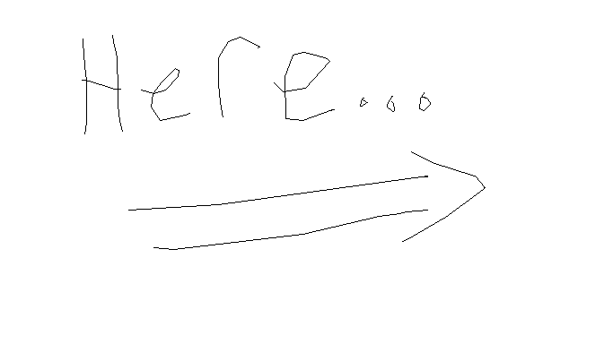

<!--  -->

### Hi there, I'm [Ductnn][website] 

 

## 👨🏻‍💻 &nbsp;About Me

    
    

<!-- ### 💸 Shopping on my [store](https://golozone.com) 💳

    

 -->

### 🛠 &nbsp;Languages and Tools:

&nbsp;
&nbsp;
&nbsp;
&nbsp;\
&nbsp;
&nbsp;
&nbsp;
&nbsp;\
&nbsp;
&nbsp;
&nbsp;
\
&nbsp;
&nbsp;
&nbsp;\
&nbsp;
&nbsp;
&nbsp;

### ⚙️ &nbsp;GitHub Analytics

    

## 🎥 Quote for you 🏙 🌅 🌇 🌆

> {office_quote}
>
> 
{office_character}

 

### 📸 &nbsp;Connect with me:

[][website]&nbsp;
[][twitter]&nbsp;
[][linkedin]&nbsp;
[][instagram]

 

[website]: https://ductn.info
[twitter]: https://twitter.com/ductn4
[instagram]: https://instagram.com/ductn_
[linkedin]: https://linkedin.com/in/ductnn
